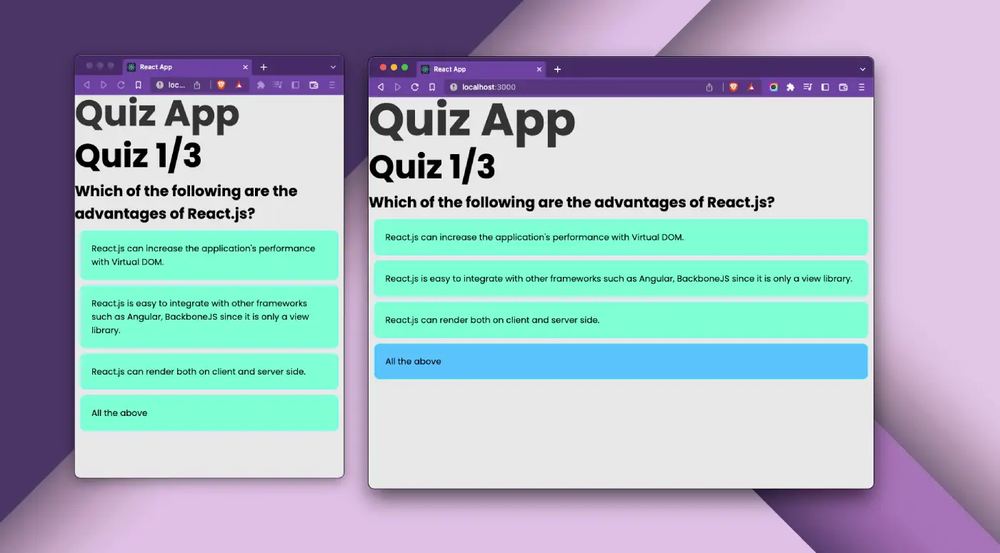

# Quiz app made in React.js.

[Try the demo](https://jsohndata.github.io/quiz-app/)

 

# Notes:
URL: [jsohndata.github.io/quiz-app](https://jsohndata.github.io/quiz-app/)
* Made with useState and Props.
* Layout with React Bootstrap.
* Custom hook to change the background image upon submission.

 

# Progress:
## BareBone

[See the branch](https://github.com/jsohndata/quiz-app/tree/main)